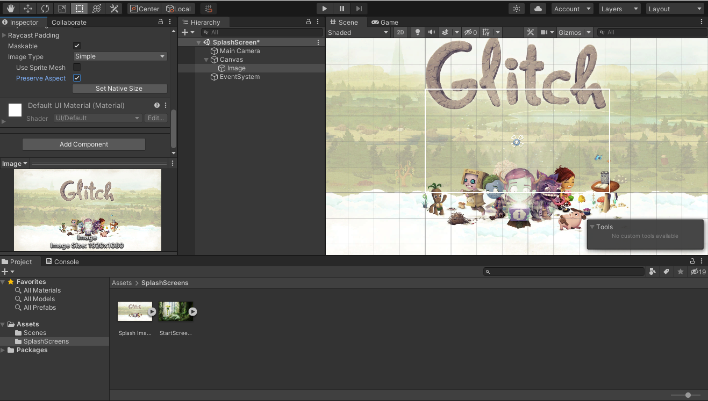

## DEV-01, Making a Splash Screen
#### Tags: [creating scenes, canvas, text, image]

### Create a scene
Grab the 1920 x 1080 size screen at `https://www.glitchthegame.com/downloads/`
+ Create a Canvas with right click `UI > Canvas`
+ Create an image within Canvas `UI > Image`
+ Create some text `UI > Text`

### Creating some text with nice Font

`https://www.dafont.com/`
+ Imported `Funky Junk` Font
+ Added text
+ Added sounds
+ Duplicated to create a start scene
+ StartGame and quit made into buttons
+ Created script for scene management
+ Create a coroutine within the script to add int delay
+ Added within build setting our current two scenes
+ created prefabs for safety

Ran into an annoying issue where unity kept overwriting my scenes

