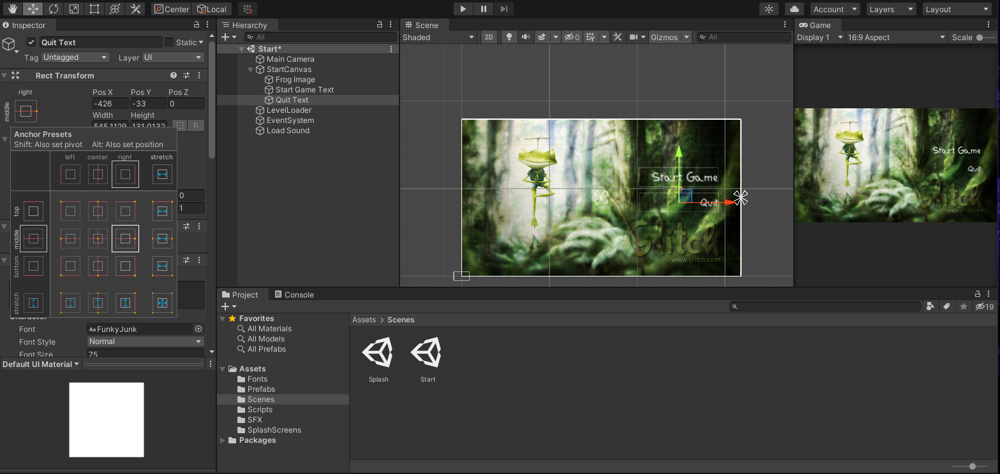

## DEV-02, Scaling & Aspect Ratios
#### Tags: [aspect ratios, camera, canvas, text, image]

### Scaling the Canvas and Image
+ Within Canvas, `Canvas Scaler` under `UI Scale Mode` select in the dropdown `Scale With Screen Size`
+ Within Canvas, `Canvas Scaler` under `Reference Resolution` change the dimentions to match that of the image. X `1920` Y `1080`
+ Within the image be sure to `Preserve Aspect` and `Set Native Size`

### Change the default background to black
+ Go to the `Camera` game object and change the color to black

### Anchoring
+ make sure the buttons are always aligned to the right no matter the aspect ratio
