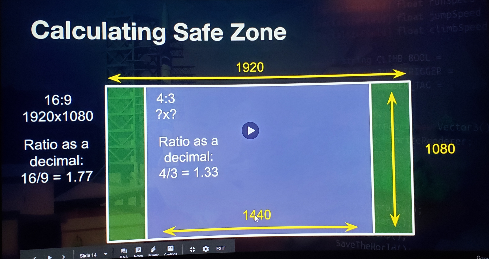
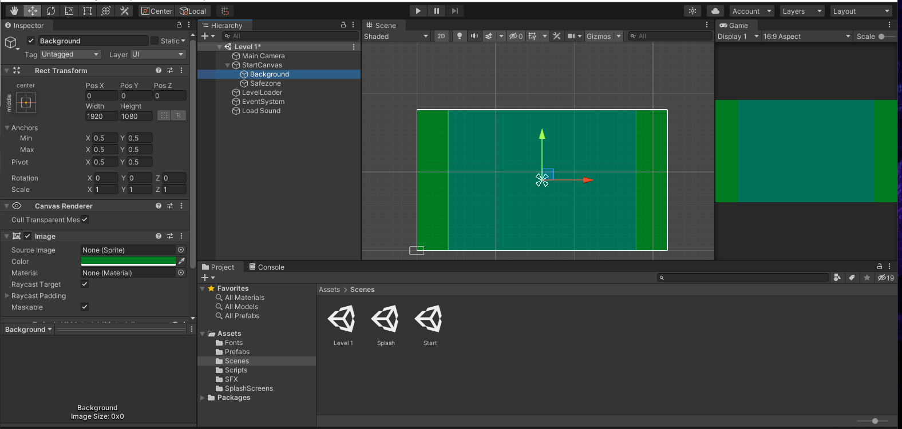
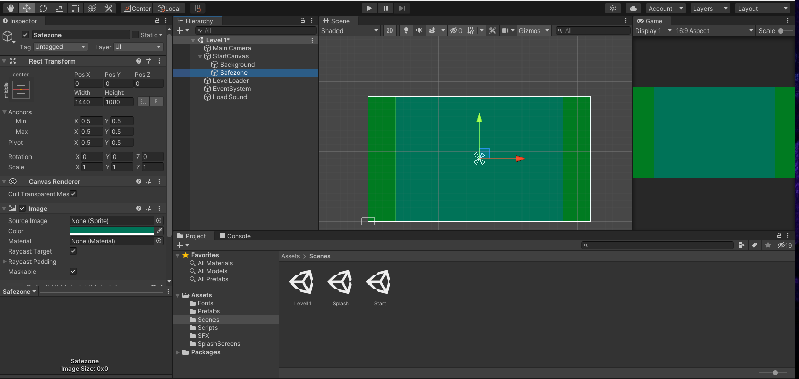
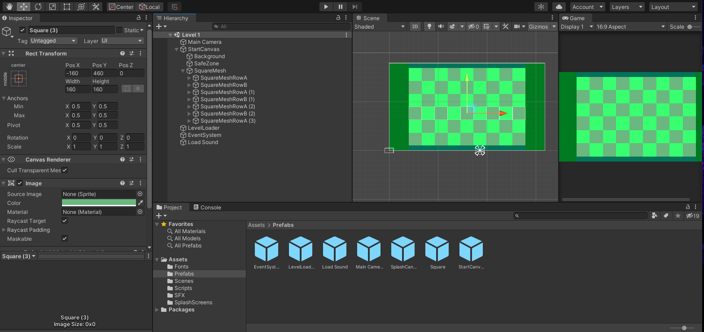

## DEV-03, Setting up Background Play space
#### Tags: [aspect ratios, camera, canvas, text, image]

### SafeZone dimentions

### creating the squares
+ We want 9 squares in our safe zone
+ We need to calculate the width of one of these squares

Math:
1440 / 9  = 160
since square then its 160 x 160

Ill likely never create a grid in this manner ever again. and will like auto generate but for now this is the grid