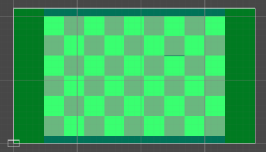
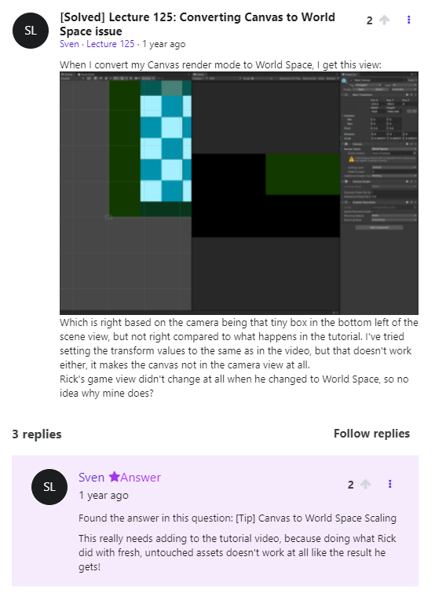
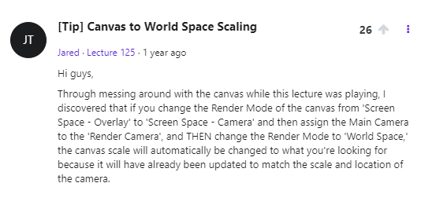
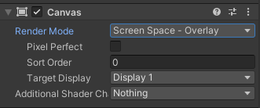
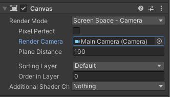
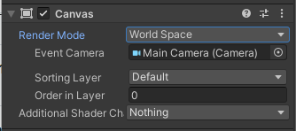
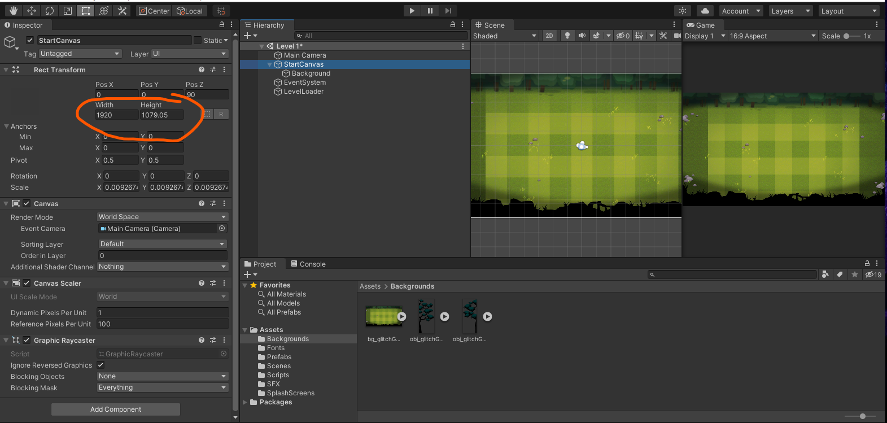
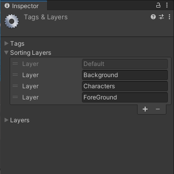
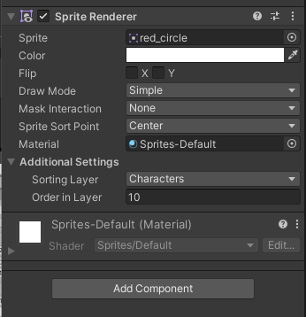

## DEV-04, Setting Up World Space Canvas Mode
#### Tags: [camera, canvas, 2d art]

### Camera and Canvas

Ever notice in the bottom left corner that the camera is usually separated from the canvas?
The canvas is usually independent



But this time around instead of just slapping on the canvas before the camera view, we want to use it as our play space

to change that we need to look at our `Render Mode` for `Canvas`
We are using Screen Space Overlay which is what we usually do

`https://docs.unity3d.com/Packages/com.unity.ugui@1.0/manual/class-Canvas.html`

We are going to do World Space because we want game elements all around our canvas UI
It will render our UI as though it were a plane in the world

If the Game view is doing something weird like this:







Drag the Main camera from the Heirarchy into the Render Camera






### 2d Art Link
`https://2dgameartguru.com/`

### Aligning our background with our game and game camera

not neeeded anymore, we placed our canvas in or camera already with a much better method prior
```
1 grass square = 1 world unit 
we are essentially creating a grid system

Our canvas width is 1920 pixels

Unity however thinks this is 1920 world units


```
### To create a sprite

`Right click on Hierarchy > 2 DObject > Sprite > circle`

### Getting Sprite Renderer



