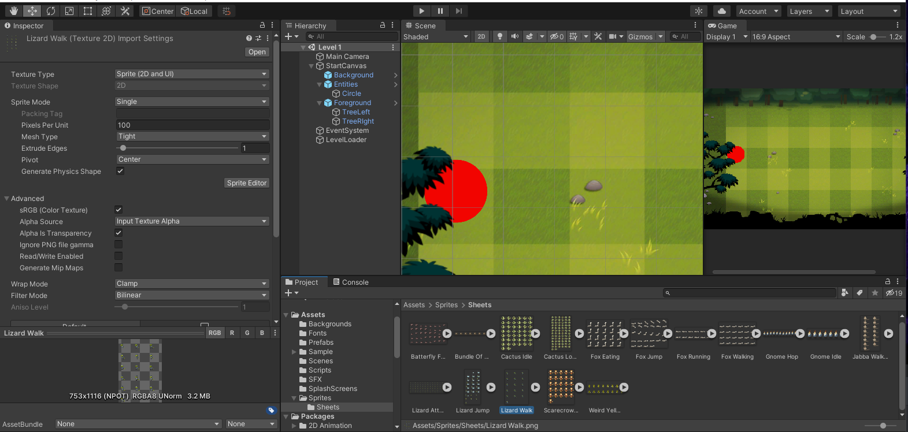
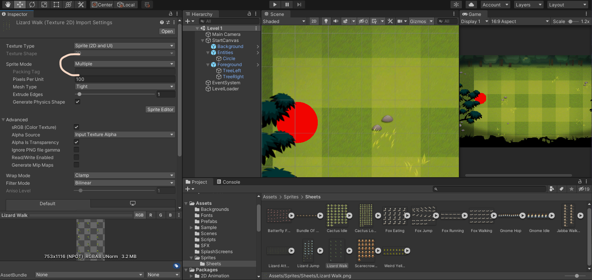
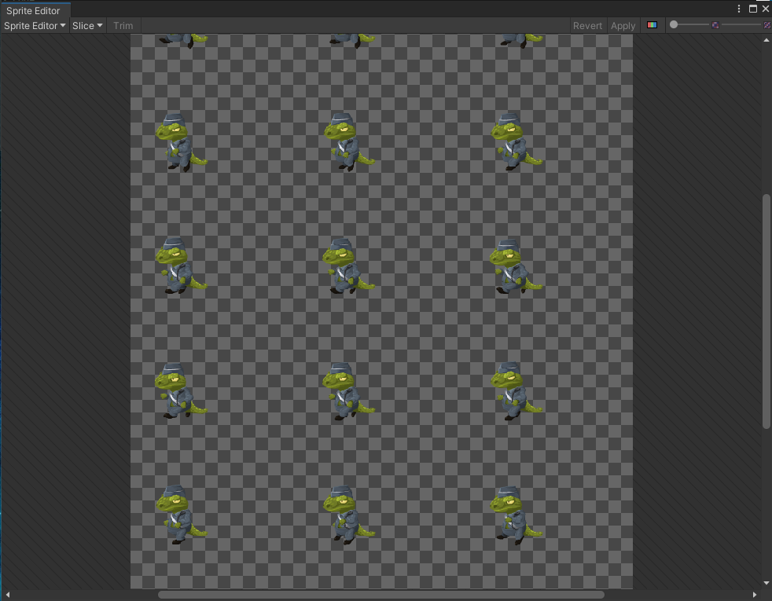
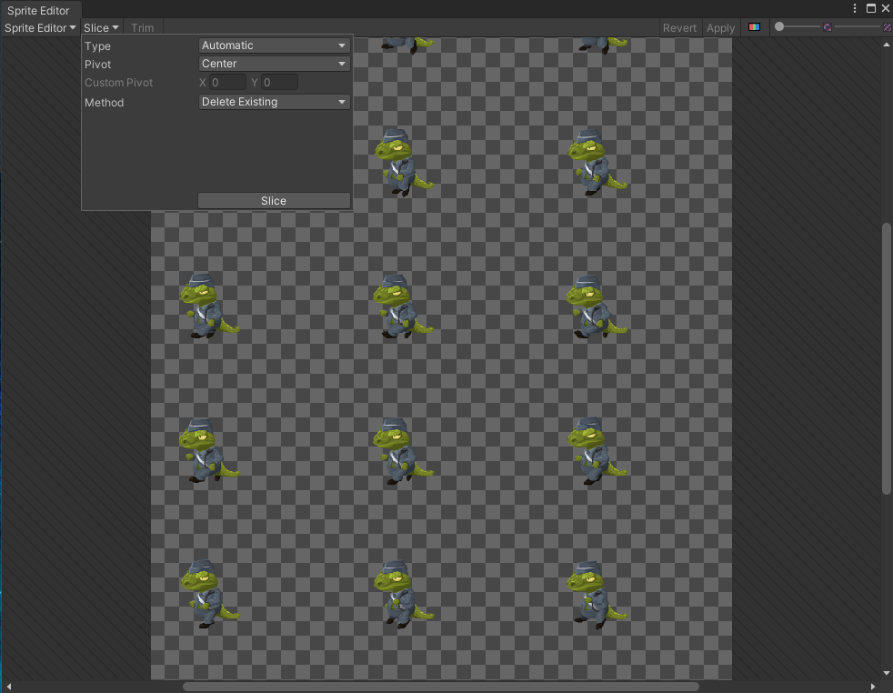
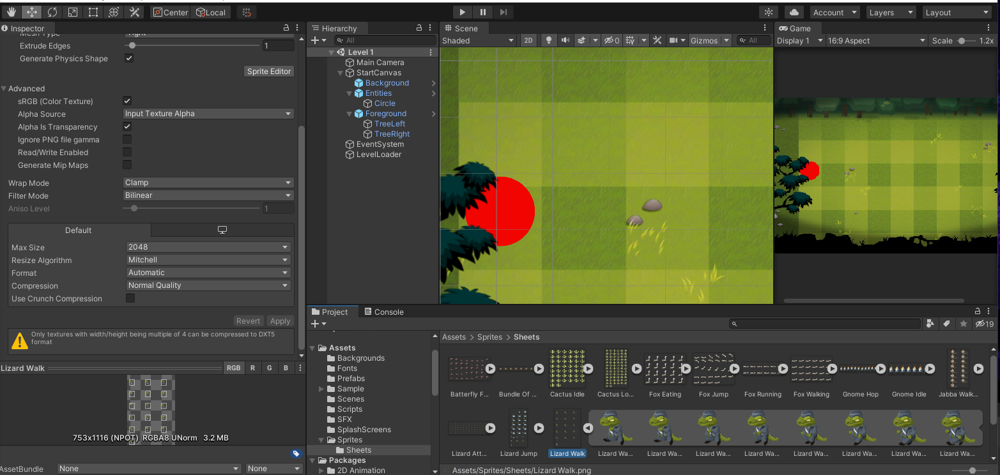

## DEV-05, Intro to Animation
### Tags: [animation]

### SpriteSheet Animation

After importing our sprite sheet we will be slicing it up

+ Select sprite sheet 

+ Change sprite mode to Multiple and then scroll down to apply

+ Click on the Sprite Editor button under the sprite mode section

+ Click on Slice and Keep the type setting on Automatic (Other options like grid by cell size are an option too in the future)

+ See chopped up image in filesystem

