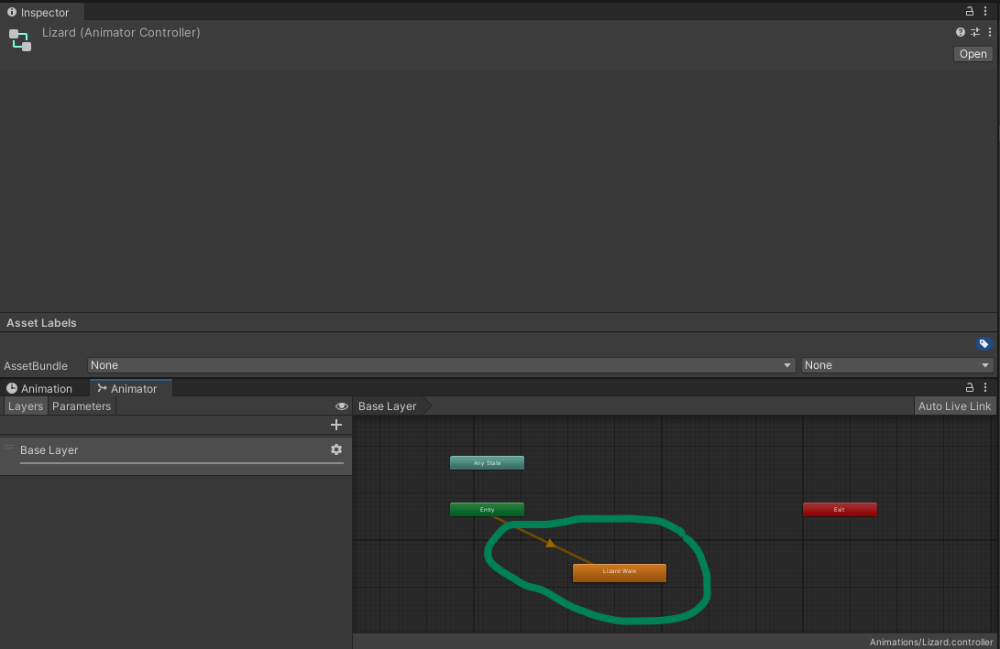
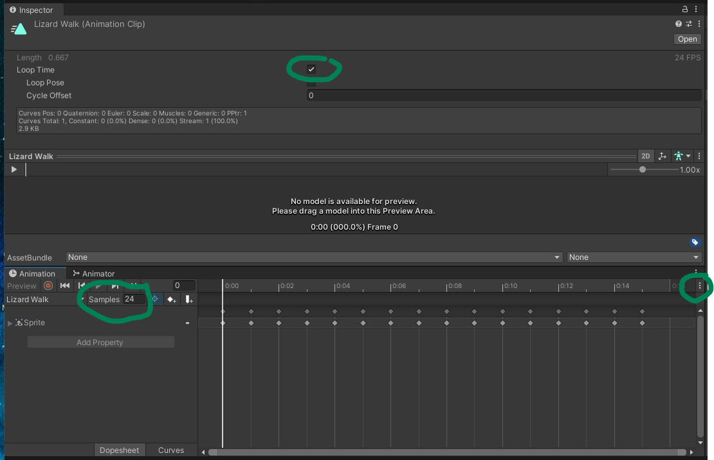
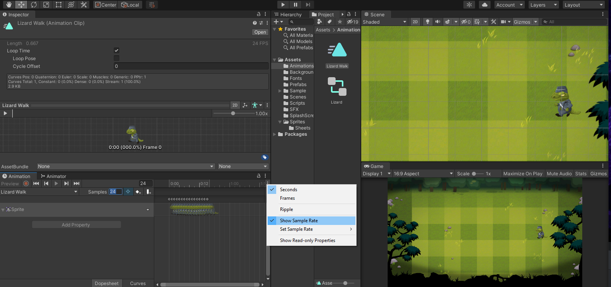

## DEV-06, Animator Controller & Animation
### Tags: [animation, controller, sort layers]

### Terminology
Animator Component - Assigns animation to GameObjects through an Animator Controller
Animator Controller - Arrangement of animations and transitions (state machine)
Animation - Specific pieces of motion
Sprite Renderer - displays the 2D sprite on screen

### Before animating, fix sort order issues. Make sure all objects are in their correct plane (DEV-06A)
+ Make sure that the background, characters and foreground images are applied with sprite renderer component, NOT IMAGE COMPONENT
+ Make sure each of the sprites are scaled accordingly
+ apply correct sorting layers 

### Steps (https://www.udemy.com/course/unitycourse/learn/lecture/12379078#questions/13619844)
+ Create a new Game Object called Lizard
+ Add Renderer Component to the Lizard Game Object (make sure you add the lizard sprite within `Sprite` property)
+ Add Animator Component to Lizard (Requires a Controller)
+ Create an Animations folder
+ Create Animator Controller within the Animations folder `Right Click > Create > Animator Controller` 
+ Rename the controller Lizard

Ignore the stuff in the green circle within the Animator Base Layer for now until we create our animation

+ Add the `Animator Controller` to the `Animator Component` of the Lizard Game Object
+ Create Animation by highlighting all your frames then `Right Click > Create > Animation`
+ Call this Animation `Lizard Walk`

+ To increase the speed of your animation, click on the 3 dots to indicate show sample rate
+ Tune the speed of the animation, update the samples property
+ Revisit the Animator Base Layer and drop your `Lizard Walk` animation into it (Green circle)

+ play game to see animation

### Animating the Lizard

+ Create a new Game Object call Lizard
+ Add Renderer Component to the Lizard Game Object

https://www.youtube.com/watch?v=PtVkXtikxi4

https://www.youtube.com/watch?v=UWhXS6iVsUM