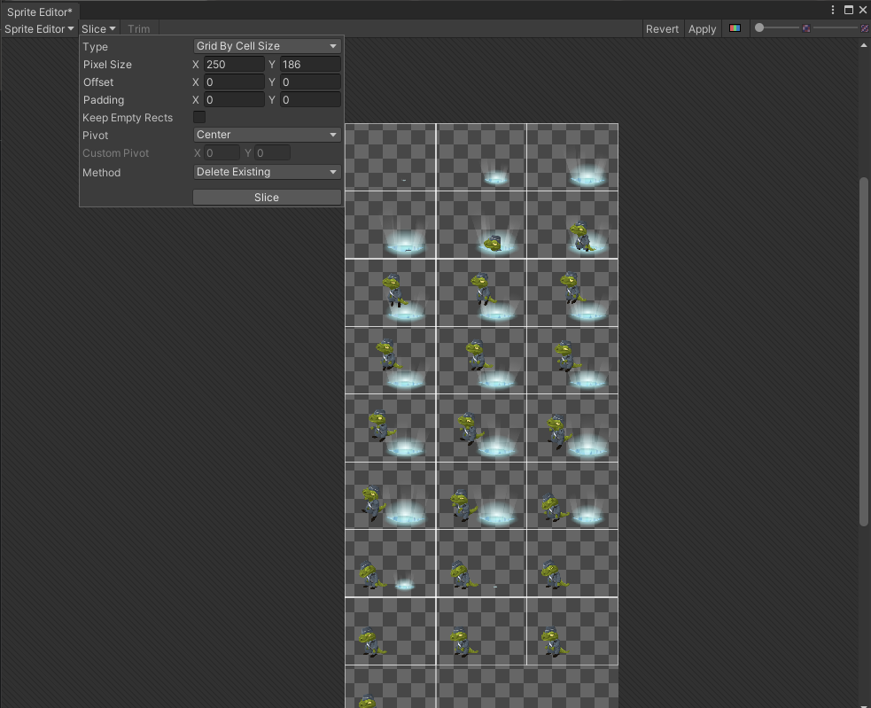
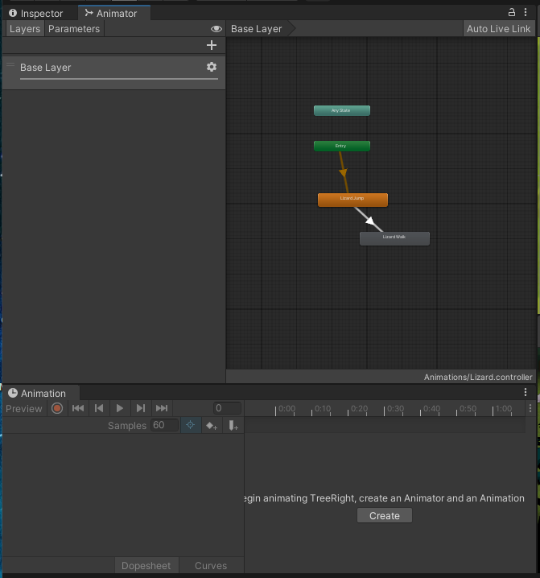
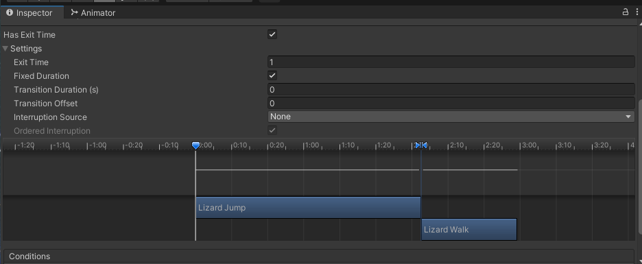

## DEV-07, Basic Animation Transition
### Tags: [animation, transtions, DEV-05, DEV-06]

### Animation Transitions
This video explains how to go from one animation to another
+ With DEV-05 notes, create sliced spreadsheet Lizard jump
+ Instead of Automatic however do grid by cell size: 

+ After you have created your Animation Object and tested it. To connect one animation from `Right click in the Animator > Make Transition`
+ May need to redo Lizard walk to that it also has a spreadsheet thats sliced by `grid by cell size`

+ Be sure to make any adjustments to make sure it loops and is at the proper speed
+ No need to blend animations in 2D

