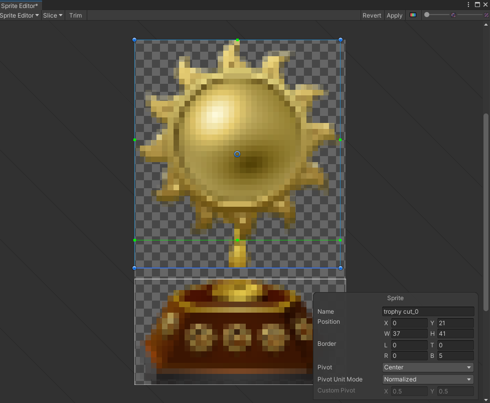
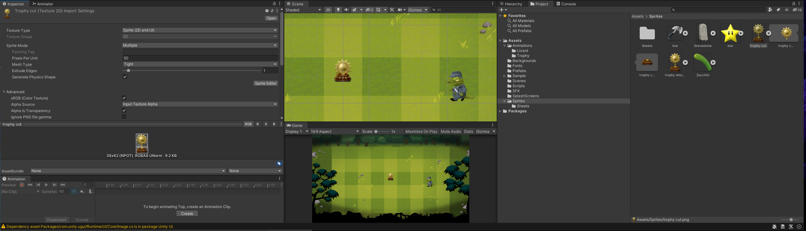
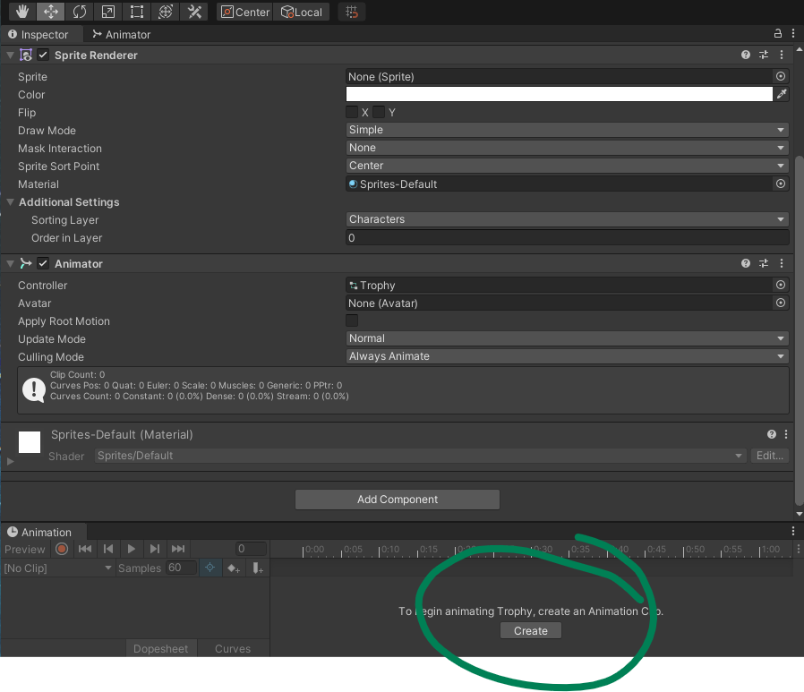
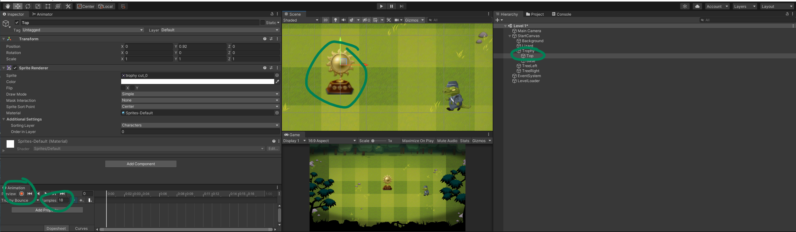
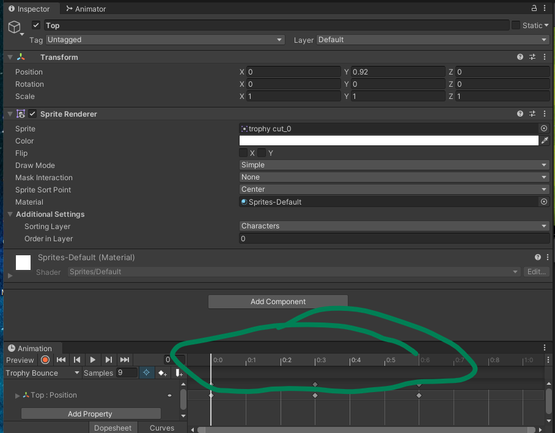

## DEV-08, Key Frame Animation
### Tags: [animation, keyframe]

### Slice up the trophy in two
+ pretty much DEV-05 again but with just one cut across the center, using automatic

### Making an animation picture bigger

### Create a new Animation Clip

+ Create a new animation called Trophy Bounce
+ Grab the `Top` child Game Object of `Trophy`
+ Be sure to change the Animation `Samples` to about 18
+ Bring the images to a proper default position
+ Press record

+ Make changes to the game object position and go to next animation here

