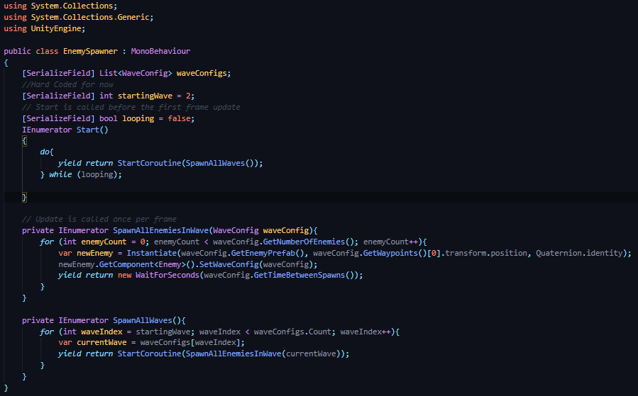
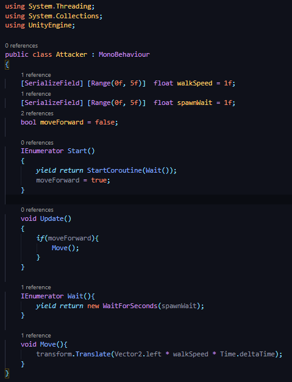

## DEV-10, Spawning using Coroutine
### Tags: [spawning]

### Create our spawners game object and create script

### Make it so the attacker takes a short bit of time to finish spawning

### Scaling

Initially I had the scale of the lizard to very large proportions in order to see it, but I scaled it down once I needed to spawn it progrmatically

### Notes

Quaternion.identity is the "default" rotation of an GameObject, or effectively Quaternion.Euler(0,0,0).  It's always the same. 

Transform.rotation is the current rotation of a gameObject, which means it will be different throughout the game as the object rotates.  It's not always the same.

Further, "transform" doesn't usually refer to the instantiated object's transform. It refers to the gameObject that is doing the instantiation.  If I want to instantiate lasers from a spaceship, for example, I might use "transform.rotation" to spawn the lasers so that they will be facing the same direction as the ship, whichever way that might be. 

If I spawn new ships though, I'll probably instantiate with Quaternion.identity so that they always start out facing the proper direction. 