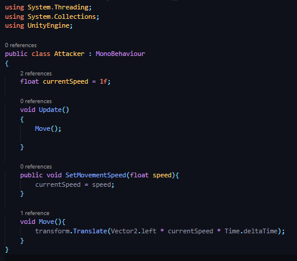
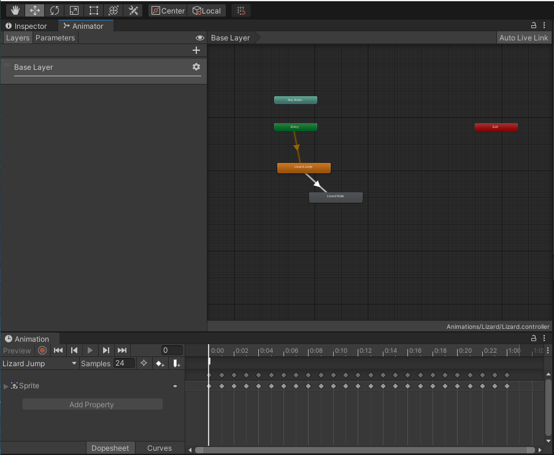

## DEV-11, Animation events
### Tags: [animation, events]

<!--  -->

## Code refactor for attackers

## Adding an animation event for jump

+ Click on the `LizardJump` animation in the `Base Layer` (ORANGE BUTTON)
+ Be sure to click on the blue thing before you head tot the inspector tab in order to see this screen

+ Make sure the lizard has a speed of float 0 while jumping

## Adding an animation event for walk

+ Click on the `LizardWalk` animation in the `Base Layer` (GRAY BUTTON)
+ Be sure to click on the blue thing before you head tot the inspector tab in order to see this screen

+ Make sure the lizard has a speed of float 2 while walking

