## DEV-12, Set Up A Defender Prefab
### Tags: [animation, sprite size]

## Set Up Cactus sprite sheets

+ First create a Cactus folder within your Animations folder

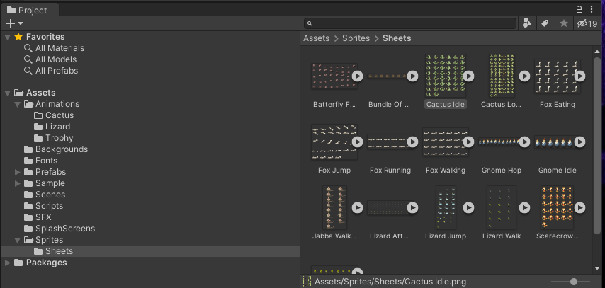

+ Select the Cactus Idle sprite sheet in `Sprites > Sheets`, and on the inspector, change the `Sprite Mode` to Multiple
<!-- + Change the pixels per unit to 75 to make it a bit bigger -->
+ Click on the Sprite Editor Button afterwards

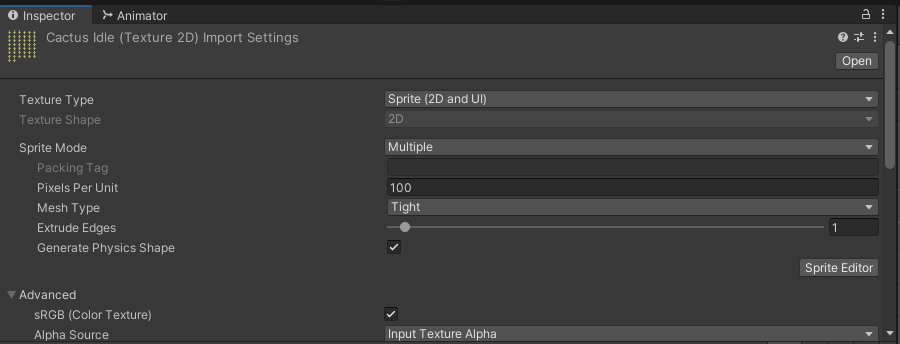

+ This sprite sheet has a bit of off set to it, adjust accordingly
+ NOTE: This was done incorrectly, instead get the size to the entire sprite sheet and divide it according to the number of sprites per dimention

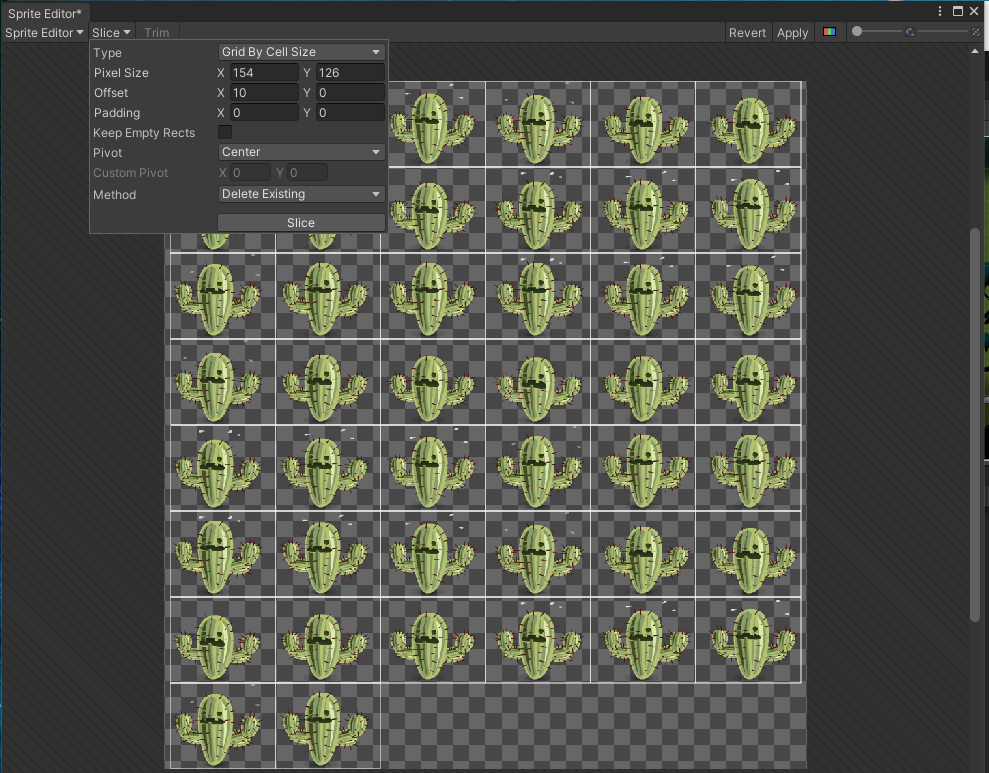

+ Repeat these steps for the other cactus sprite sheets

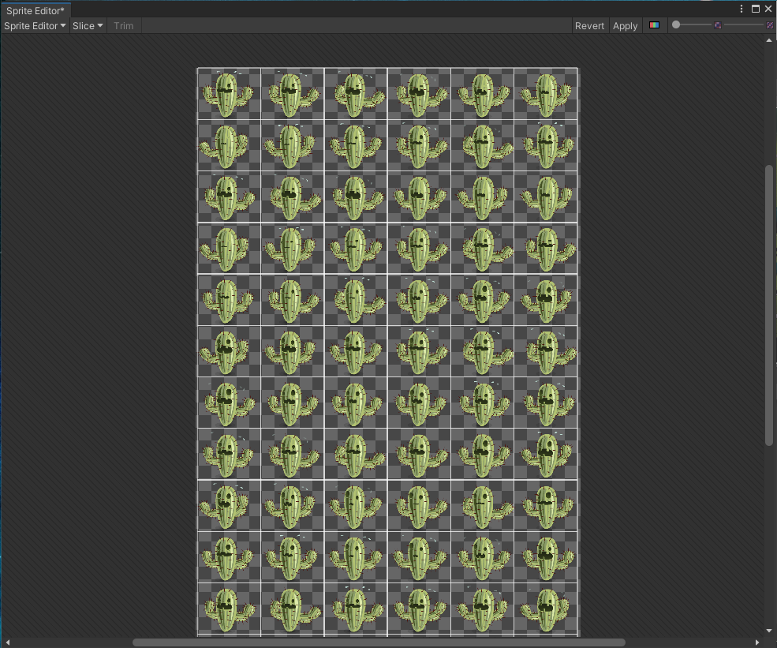

## Create the Animator

+ Create a new Game Object to contain our Defender and call it `Cactus`
+ Reset the transform
+ Place it within the Start Canvas and be sure to apply
+ Add a `Sprite Renderer` component so that we can see the Cactus, choose one of the frames
+ Update the Sorting Layer to `Characters`. put in a random Order in Layer for now
+ Add the `Animator` component 
+ In the Cactus folder, create an Animation Controller `Right-click > Create > Animator Controller` and call it Cactus. Only need one of these for now per Game Object
+ Add the Cactus Animator to the `Controller` property

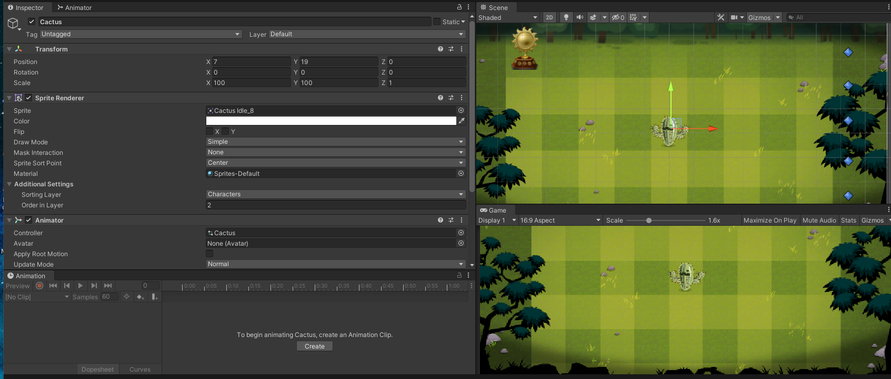

## Create the Animations

+ Expand the animation sheets by clicking the arrow and highlight with shift to select all of them
+ Once selected, `Right-click > Create > Animation`
+ Call the Animation Cactus Idle

+ Repeat these steps for the other cactus sprite sheets

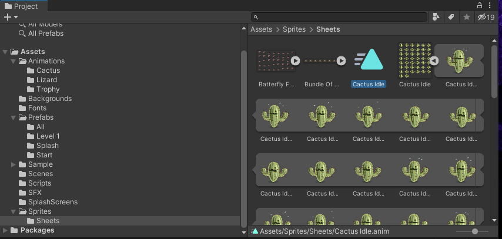

+ Place all animations in the Cactus folder

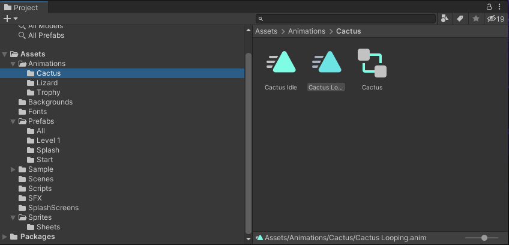

+ Make sure that both the animations loop (later on we will only want cactus atack to loop)

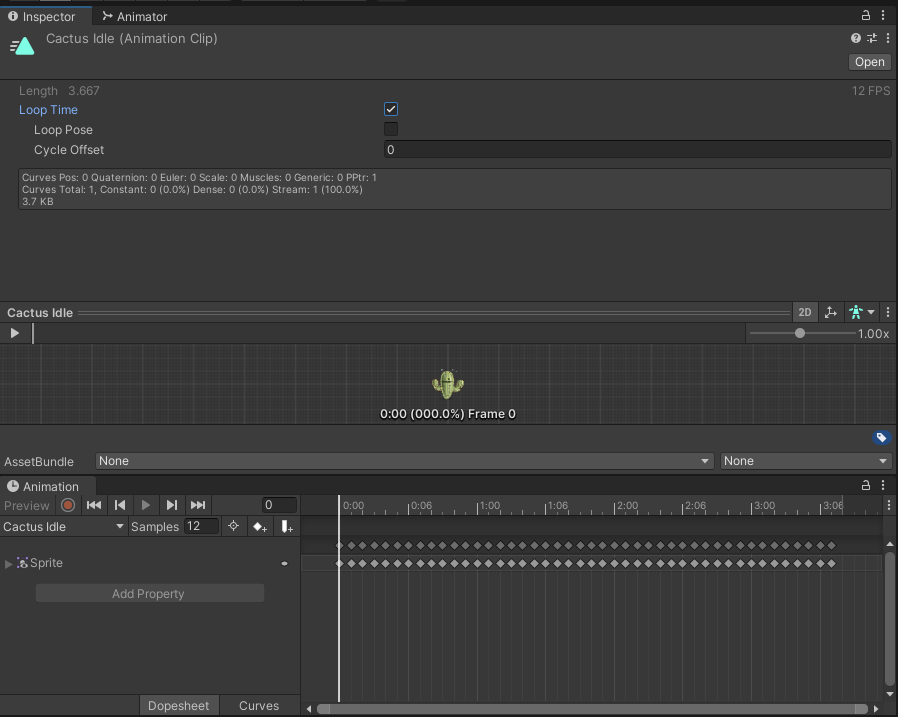

+ Click on the blue transition (might be white if unselected) then click on the inspector

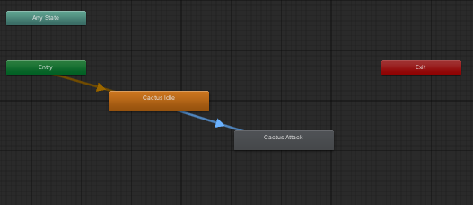

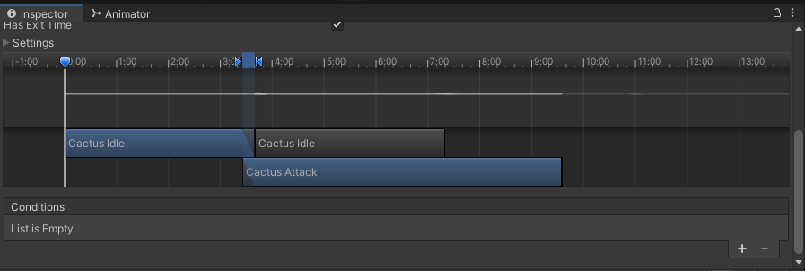

+ Make sure there is no fading transitions
+ Click on the arrow next to settings and make `Transition Offset` 0 ``Transition Duration` 0 and `Exit Time` 1

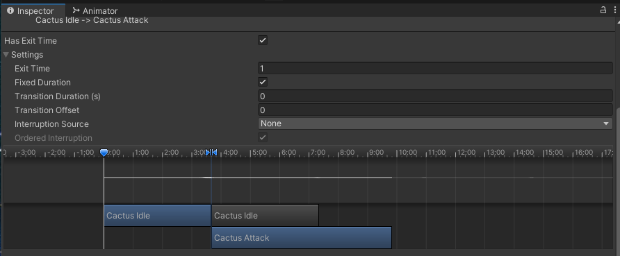