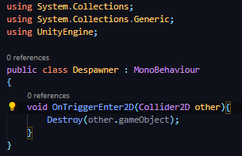
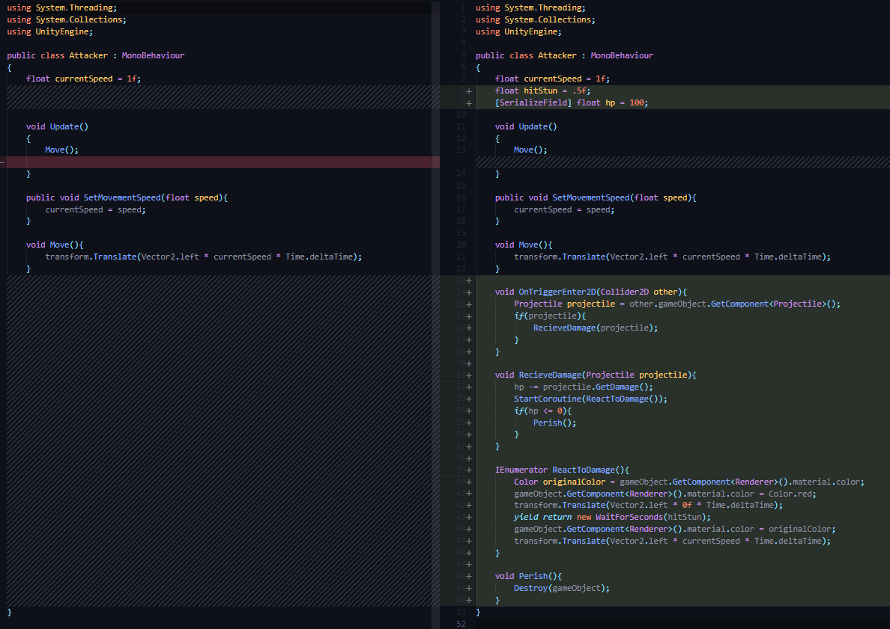
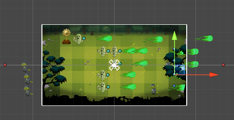

## DEV-14, Have fireballs hit lizards
### Tags: [collision, isTrigger]

### Add collisions to both Fireball and Lizard

+ Add Box Collider 2D component to both
+ Check off Is Trigger for Fireball
+ Add a RigidBody2D for Lizard

### Add Despawners as triggers

+ destroy lizards
+ destroy fireballs

### Despawner

### Attacker

+ destroys on contact when at the same x as the red dots

