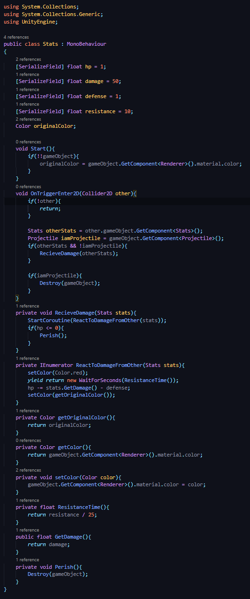

## DEV-15, Death FX
### Tags: [animation, keyframe, collision matrix, hp, damage]

### Unity Links

https://docs.unity3d.com/ScriptReference/Animator.html

### Make it so that the fire balls dont hurt while the Lizard spawns

+ Box collider 2D disabled while jump animation is on

+ Box collider 2D enabled while walk animation is on

### Add collision for Defenders

+ Rigidbody 2D
+ Box Collider 2D

### Create a Collision Matrix

+ Add new Layers

+ Create our new Layers

+ Add Projectile Layer to Fireball

+ Add Attacker Layer to Lizard

+ Add Defender Layer to Cactus

+ Construct the collision matrix at `Edit > Project Settings > Physics 2D`

+ Updated Physics Matrix

## Created Stats Managment

+ Stats.cs

+ Attacker.cs

+ Projectile.cs

Then gave Projectiles and Attackers the script

### Death on Animation

+ create an explosion animation and add it to the attacker
+ make sure the death animation on the right Sorting Layer and Order in Layer

