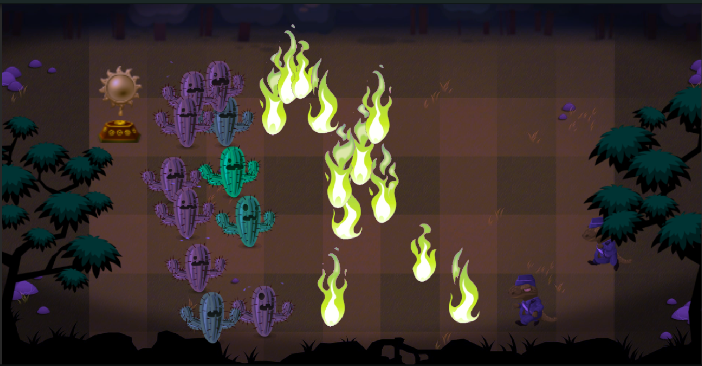
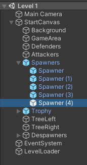
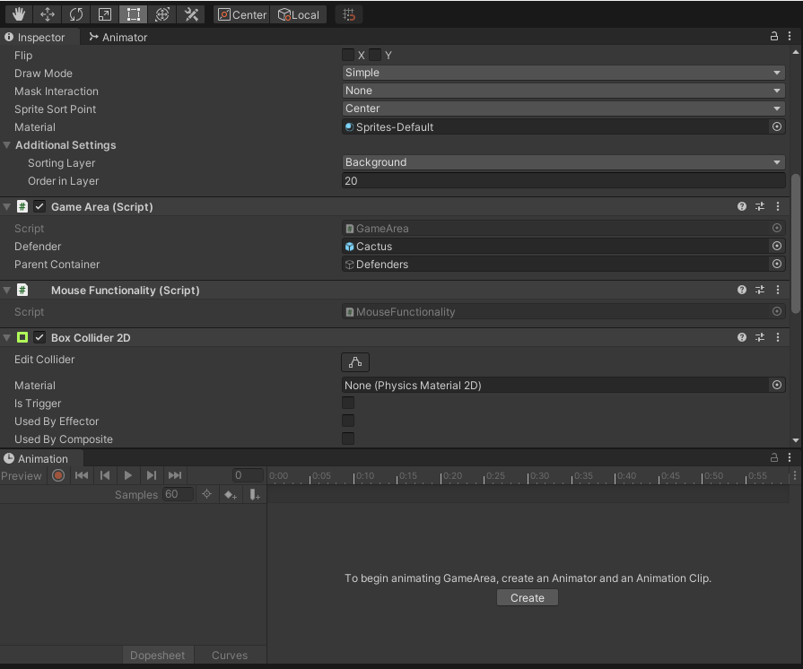
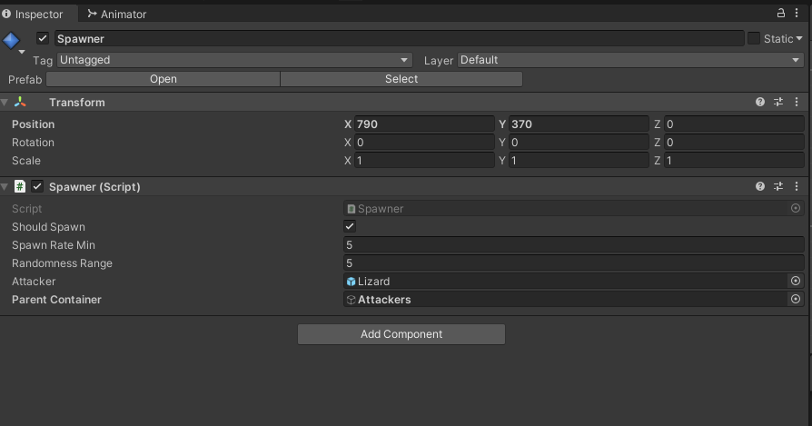
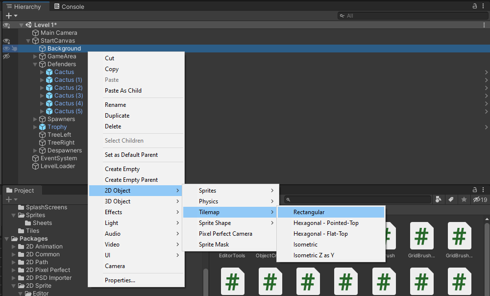
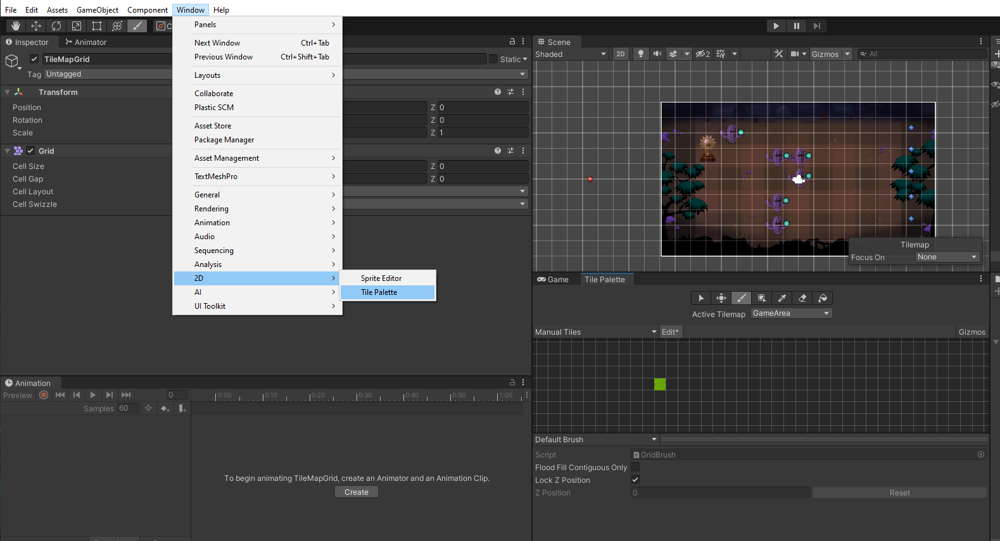
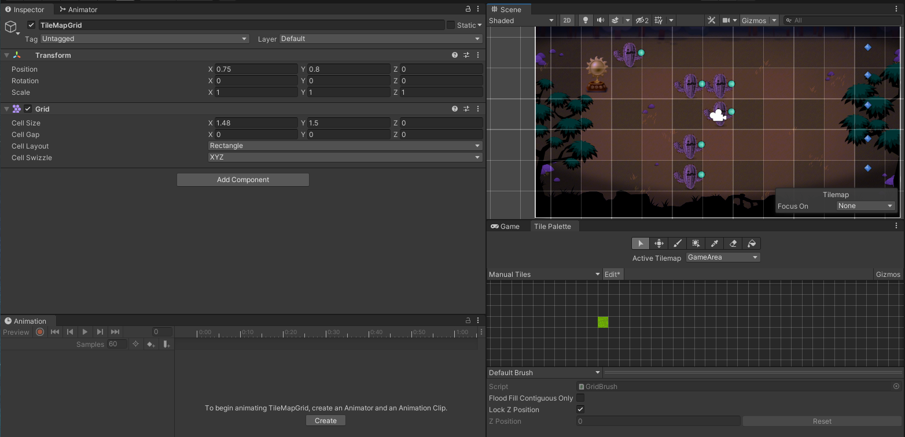
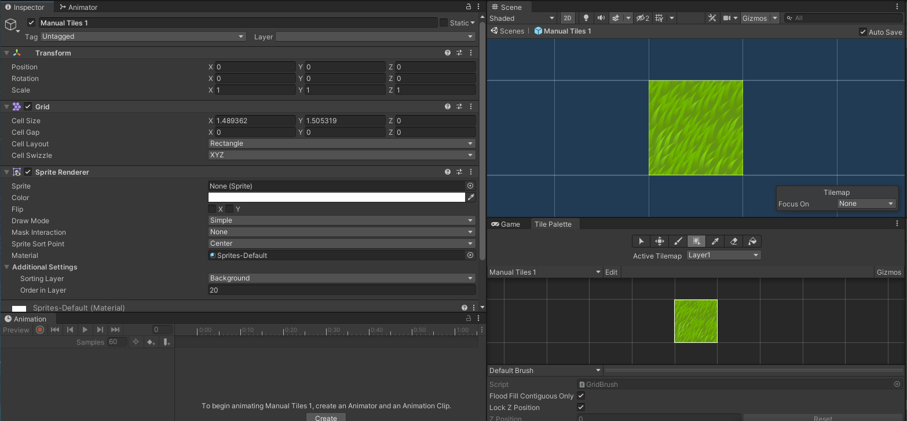
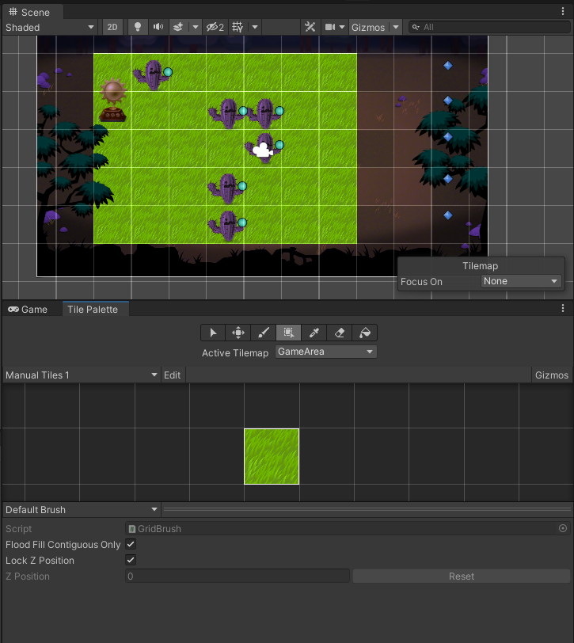

## DEV-16, Spawn Defenders upon mouse click
### Tags: [mouse click]

### Create a Game Area with mouse interaction
+ Be sure to add a BoxCollider2D

### Spawn at mouse position
+ Refer to MouseFunctionality.cs and Spawner.cs 
+ we also made sure that the new instances spawned inside a parent container, Spawner.cs also does this.
+ If there is a moment where instances of prefabs are appearing tiny, refer to Spawner.cs

+ GameArea Game Object, [SerializeField] on both the prefab and the parent to the prefab

+ Spawner Game Object, [SerializeField] on adding both the prefab and the parent to the prefab

### Introducing Tilemaps Early (DONT DO THIS)
https://docs.unity3d.com/Manual/Tilemap-Painting.html

+ Create a tilemap 

+ Rename the tilemap to GameArea
+ Rename the grid to TileMapGrid

+ If you are missing the Tile Palette, then set up through `Window > 2D > Tile Pallete`

+ Create a Tiles folder
+ Create a new Pallete (called mine Manual Tiles) and save it in the tiles folder
+ Drag and drop your tilesheet into the Tile Pallette space. These will be considered our Manual Tiles
+ You can go to the sprite sheet to manage the Pixel Per Unit to fit in the squares in your Scene (also be sure order in layers are good)
+ Make sure that the Active Tilemap is GameArea

+ Go to TileMapGrid and adjust the size of the square to this

+ To make sure it appears on the tiles, go to Manual Tiles within you Tiles folder and open the prefab
+ Then add a Sprite Renderer component and make sure the correct Sorting Layer and Order in Layer are applied

+ Now we are able to apply tiles

### Introducing behavior to tiles

https://docs.unity3d.com/2021.2/Documentation/ScriptReference/Tilemaps.TilemapCollider2D.html
https://docs.unity3d.com/2021.2/Documentation/ScriptReference/Tilemaps.Tile.html
https://gamedev.stackexchange.com/questions/150917/how-to-get-all-tiles-from-a-tilemap
https://docs.unity3d.com/2021.2/Documentation/ScriptReference/Tilemaps.TilemapCollider2D.html
https://docs.unity3d.com/2021.2/Documentation/ScriptReference/Bounds.html

+ Add a `TileMapCollider2d` component to our GameArea
+ Make sure it is on the GameArea Layer (newly created) so that it does not intreract with anything else in the collision matrix