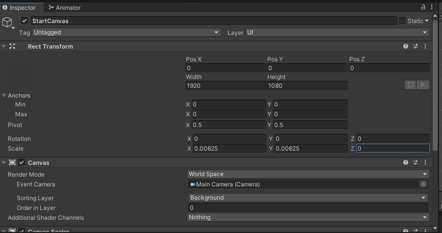
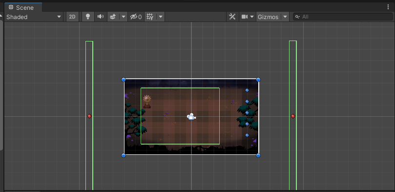
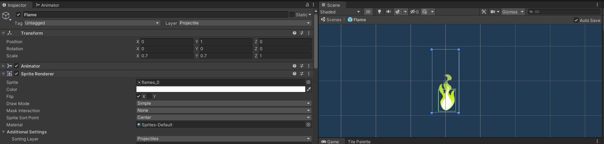
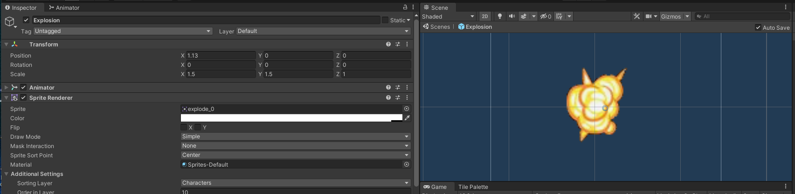

## DEV-17, Double checking our world units
### Tags: [canvas, scaling]

### Rescale our canvas
+ Update the scale property to reflect this math
```
Screen width is 1920
each square will be 160

1920 / 160 = 12 world units as our width

so we need to shrink 12 / 1920 = 0.00625

```



+ Shrink the main camera's size a bit to match the size of the background



+ Scale down the size of flames



+ Scale down the size of explosions


