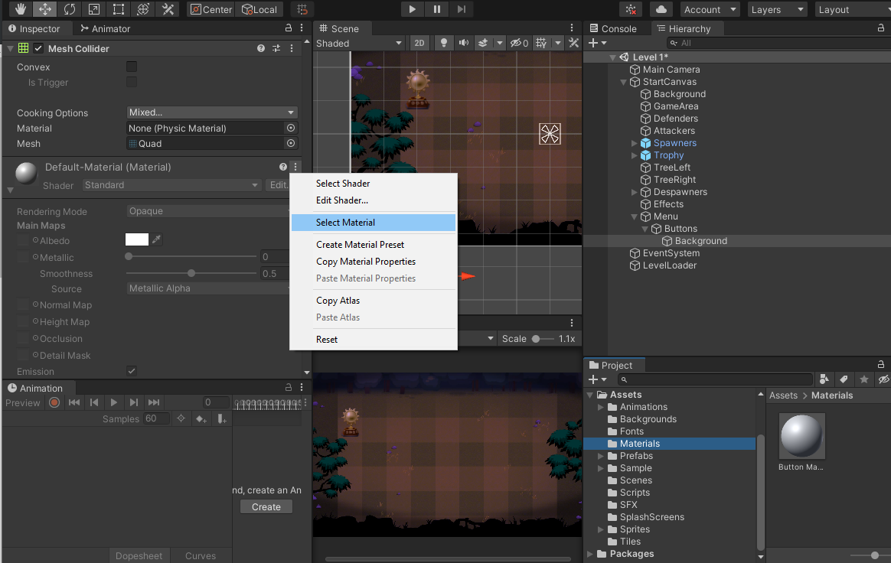
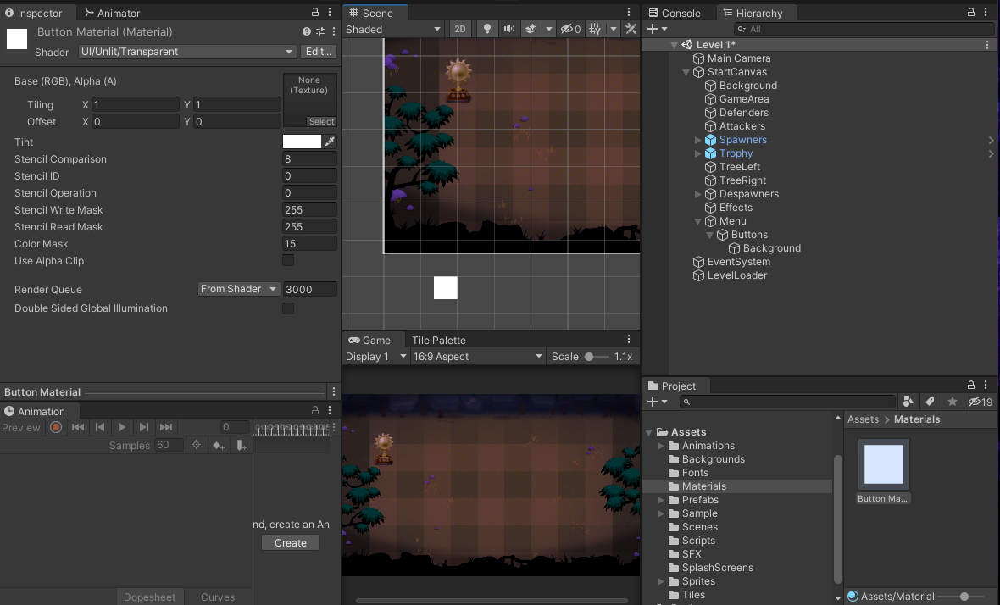

## DEV-18,  Create Defender Selection UI
### Tags: [Menus, Quad, MouseDown, Buttons, Color]

### Quad vs Sprite (positioning was a massive pain, use sprites)

Because we have created our background in wold space units now, for easier positioning, we can use whats called quads (one side of a cube)

+ Resized the scaling by 100x100 so far so that can see it

### Create a new Material (positioning was a massive pain, use sprites)

+ Create a new material folder

+ Create a new Material by `Create > Material` and call it button Material

+ Then in Background which is a child of Buttons of Menu, replace its Default-Material with the Button Material

+ Change the black default color by first changing the Shader `UI > Unlit > Transparent`

+ Be sure to drag the Button Material to the instance of Background on the Scene

### Colors
    button.GetComponent<SpriteRenderer>().color = new Color32(41, 41, 41, 255);

### Script
